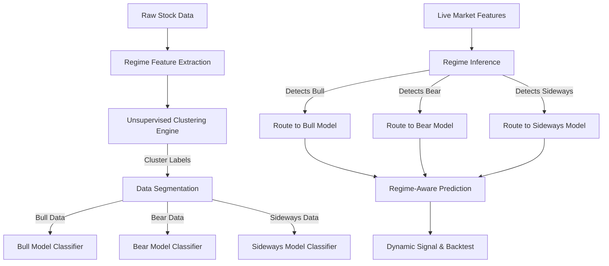

# Design Specification: Market Regime Detection Engine (V2)

This document provides a detailed technical specification and phased implementation roadmap for integrating the **Market Regime Detection Engine** into the QuantML Research Platform.

---

## 1. Overview & Core Hypothesis
A fundamental limitation of standard machine learning trading strategies is **regime drift**. Financial markets are non-stationary; they alternate between periods of strong trends (high momentum, low volatility), range-bound consolidation (mean-reverting, low volatility), and high-stress panics (negative momentum, extreme volatility).

A single global model trained on all historical data will inevitably optimize for the "average" market state, underperforming during transitions. The **Market Regime Detection Engine** solves this by:
1. Identifying the active market regime using unsupervised learning.
2. Segmenting historical data into specialized datasets.
3. Training regime-specific classifiers (e.g., Bull Model, Bear Model, Sideways Model).
4. Swapping models dynamically at prediction time based on the active market regime.

---

## 2. Phased Implementation Roadmap

### Phase 1: Regime Feature Engineering
In this phase, we generate features specifically selected to describe the **macro state** of the market, rather than daily micro-movements.

#### Key Features & Formulas
*   **Trend Strength ($TS$):** Measure of long-term trend direction and magnitude.
    $$TS_t = \frac{EMA_{50}(C_t) - EMA_{200}(C_t)}{EMA_{200}(C_t)}$$
*   **Rolling Volatility ($\sigma_n$):** Standard deviation of daily log returns over a rolling window (typically $n=20$ days) to capture risk.
    $$\sigma_{n} = \text{std}(R_{t-n \dots t})$$
*   **Bollinger Band Width ($BW$):** Measures price compression/expansion to identify consolidation vs. breakout regimes.
    $$BW_t = \frac{\text{Upper Band}_t - \text{Lower Band}_t}{MA_{20}(C_t)}$$
*   **Trend Intensity (ADX):** Measures the absolute strength of a trend regardless of direction, differentiating trending markets from sideways chop.

#### Technical Significance
We must maintain a strict separation between **Regime Features** and **Model Prediction Features**. Regime features characterize the environment; prediction features (e.g., lag indicators, momentum oscillators) predict the next day's price path *within* that environment.

*   **Target File:** `backend/app/core/features/feature_engineering.py` (Add a new function `generate_regime_features(df)`).
*   **Output:** Generates and appends regime-specific columns to the processed CSV.

---

### Phase 2: Unsupervised Clustering & GMM Engine
Since historical market regimes do not come with pre-labeled categories, we must use unsupervised learning to discover them.

#### Implementation Steps
1.  **Normalization:** Scale all regime features using a `StandardScaler` to ensure features with large scales (like volume ratios) do not dominate variance-based clustering.
2.  **K-Means (Hard Clustering Baseline):** Cluster features into $K$ distinct groups (typically $K=3$ representing Bull, Bear, and Sideways states).
3.  **Gaussian Mixture Models - GMM (Soft Clustering Production Model):** Instead of assigning a day strictly to one regime, GMM estimates the probability distribution of each regime:
    $$P(\text{Regime} = k | X_t)$$
    This matches the reality of financial markets, where a transition phase might be $60\%$ Bullish and $40\%$ Sideways.

#### Technical Significance
Using GMMs allows us to implement **probabilistic routing** and set confidence thresholds (e.g., if regime confidence is less than $55\%$, classify it as a highly uncertain regime and remain flat in cash).

*   **New File:** `backend/app/core/regime/regime_detector.py`
*   **Saved Artifacts:** Save the fitted scaler and GMM model as pickle files: `{symbol}_regime_scaler.pkl` and `{symbol}_regime_gmm.pkl` inside `backend/data/models/`.

---

### Phase 3: Visual Analytics & Timeline UI
Traders must be able to trust the unsupervised cluster labels. Visualizing the historical classification is crucial for verification.

#### Implementation Steps
1.  **Regime List API:** Expose an API endpoint `GET /api/regime/analyse` returning the historical dates and their assigned regime index.
2.  **Regime Profiling:** Calculate statistics for each discovered cluster:
    *   *Average Return:* (e.g., Cluster 0 has $+15\%$ annualized returns $\rightarrow$ labeled **Bull**).
    *   *Average Volatility:* (e.g., Cluster 1 has $32\%$ volatility and negative returns $\rightarrow$ labeled **Bear**).
    *   *Average Duration:* The mean consecutive days spent in this cluster (measures stability).
3.  **Interactive Frontend Chart:**
    *   Render a **Regime Timeline Chart** using Chart.js, overlaying the stock's closing price with background color bands representing the detected regime (e.g. light green for Bull, light red for Bear, light gray for Sideways).

#### Technical Significance
This visual tool lets quant researchers verify that the clustering algorithm matches historical reality (e.g. verifying if the GMM successfully labeled the 2020 COVID market crash as a high-volatility Bear regime).

---

### Phase 4: Regime-Specific Model Training
Instead of fitting a single estimator on the whole dataset, we segment the training set by the identified clusters.

#### Implementation Steps
1.  **Dataset Segmentation:** For a processed stock dataset:
    *   Filter rows where GMM label = `0` $\rightarrow$ `df_bull`
    *   Filter rows where GMM label = `1` $\rightarrow$ `df_bear`
    *   Filter rows where GMM label = `2` $\rightarrow$ `df_sideways`
2.  **Multi-Model Fitting:** Train $K$ independent ML models (e.g. 3 XGBoost models) on these respective datasets.
3.  **Model Storage:** Save the resulting estimators:
    *   `{symbol}_xgboost_bull.pkl`
    *   `{symbol}_xgboost_bear.pkl`
    *   `{symbol}_xgboost_sideways.pkl`

#### Technical Significance
By decoupling the estimators, we prevent gradient updates from different regimes from interfering with each other. The XGBoost model trained on Bull data will focus entirely on maximizing momentum returns, while the model trained on Sideways data will focus on mean-reverting indicators (like RSI boundaries).

*   **Target File:** `backend/app/api/models.py` (Add parameter `regime_aware: bool` to `TrainModelRequest`).

---

### Phase 5: Regime-Aware Backtesting & Performance Report
The final phase validates the core hypothesis: *does the regime-aware system outperform the global model?*

#### Implementation Steps
1.  **Simulated Pipeline Execution:** For each out-of-sample data point:
    *   Read today's regime features $\rightarrow$ Predict regime probability using the GMM model.
    *   Select the matching model (Bull, Bear, or Sideways).
    *   Generate prediction probability $\rightarrow$ Create buy/sell signal.
2.  **Backtest Execution:** Run the daily simulation using the backtesting engine, keeping track of transaction costs and stop-losses.
3.  **Comparative Report:** Display a side-by-side performance grid comparing the **Global Model** vs. **Regime-Aware Models**:
    *   Total Return (%)
    *   Sharpe Ratio & Sortino Ratio
    *   Maximum Drawdown (%)
    *   Win Rate (%)

#### Technical Significance
If the hypothesis is correct, the Regime-Aware Model should show a significant reduction in Maximum Drawdown and a higher Sharpe Ratio by avoiding trading during high-risk bear regimes or switching to mean-reverting signals during sideways regimes.
