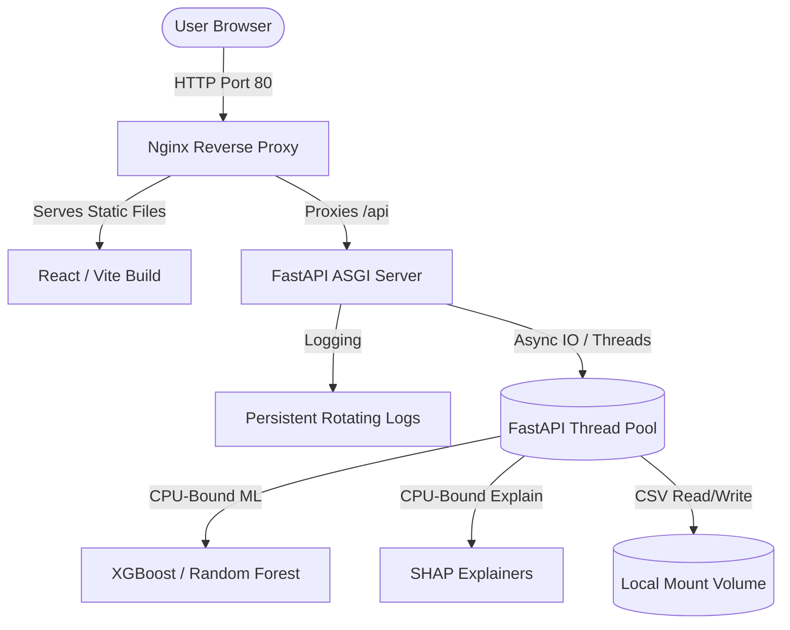

# QuantML Research Platform - Production Deployment Guide

This document details the system architecture enhancements and instructions for running the QuantML Research Platform in production environments.

---

## 1. System Architecture Upgrades

The platform has been refactored to conform to high-scalability production system design principles:



### Key Upgrades
1. **Asynchronous Computation Offloading**:
   - Heavy tasks (ML model training, SHAP value calculations, Yahoo Finance downloads, regime clustering) are offloaded to background threads using `asyncio.to_thread`.
   - This prevents blocking FastAPI's ASGI event loop, guaranteeing continuous server responsiveness even under peak workloads.

2. **Decoupled Configuration Management**:
   - Hardcoded paths and server settings have been migrated to the configuration layer (`app/config.py`).
   - Supports customization via environment variables or a `.env` file (see `backend/.env.example`).

3. **Unified API Versioning**:
   - APIs are structured with version prefixing (`/api/v1/...`).
   - Fallback routing for `/api/...` has been retained to avoid breaking legacy interfaces.

4. **Structured and Persistent Logging**:
   - A rolling file handler (`logs/quantml.log`) has been implemented to persist operational traces with timestamp logging, request methods, clients, and execution latencies.

5. **API Resilience & Health Monitoring**:
   - A `/health` endpoint is available to allow Kubernetes or container orchestrators to monitor system availability.
   - Global exception handling intercepts raw errors, logs stack traces, and converts them to consistent, user-friendly JSON models.

---

## 2. Docker & Containerized Running Instructions

The platform is fully containerized using **Docker** and **Docker Compose** for zero-configuration, production-grade deployments.

### Prerequisites
- Install **Docker** and **Docker Compose** on the host machine.

### Quick Start
To build and spin up the entire stack (Frontend + Backend + Volume storage):

1. **Start the containers**:
   ```bash
   docker-compose up --build -d
   ```

2. **Verify running containers**:
   ```bash
   docker-compose ps
   ```

3. **Check logs**:
   ```bash
   docker-compose logs -f
   ```

4. **Access the application**:
   - Open your web browser and navigate to: `http://localhost` (Port 80)
   - The interactive backend API documentation is available at: `http://localhost:5000/docs`

### Persisted Data Volumes
Docker Compose maps host directories to keep data across container rebuilds:
- `./backend/data` maps to `/app/data` (holds Yahoo Finance cache and processed datasets).
- `./backend/models` maps to `/app/models` (holds pickled ML classifiers and scaler configurations).
- `./backend/logs` maps to `/app/logs` (stores execution logs).

---

## 3. Manual / Development Run Instructions

To run the application locally without Docker in production or development mode:

### Backend Setup
1. Navigate to the backend directory:
   ```bash
   cd backend
   ```
2. Install dependencies:
   ```bash
   pip install -r requirements.txt
   ```
3. Set your environment variables (optional: copy `.env.example` to `.env` and configure):
   - Set `ENV=production` to disable reload and spawn multiple worker processes.
   - Set `ENV=development` for hot-reloading.
4. Run the server:
   ```bash
   python run.py
   ```

### Frontend Setup
1. Navigate to the frontend directory:
   ```bash
   cd frontend
   ```
2. Install dependencies:
   ```bash
   npm install
   ```
3. Run the development server (runs with API proxy configuration):
   ```bash
   npm run dev
   ```
