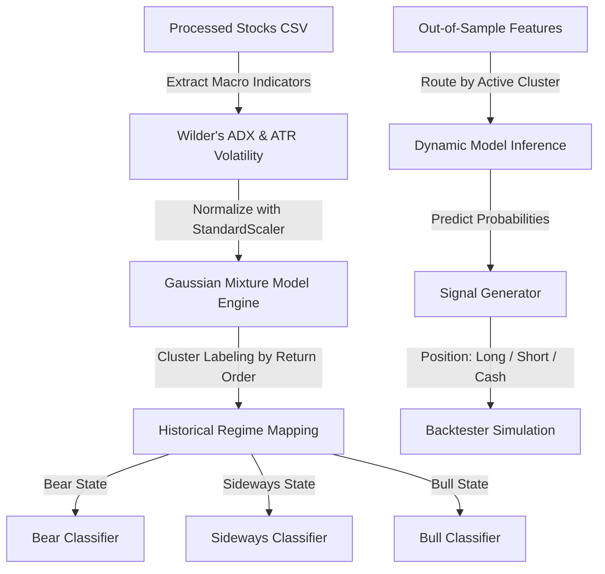

# Walkthrough: Market Regime Detection Engine (V2)

We have successfully designed, implemented, and verified the complete **Market Regime Detection Engine (V2)** across all five phases. This engine replaces single global estimators with regime-specialized sub-models routed dynamically at inference time.

---

## 1. System Architecture

The market regime engine operates as an end-to-end quantitative pipeline:

---

## 2. Phase-by-Phase Technical Accomplishments

### Phase 1: Feature Engineering for Regimes
*   **Wilder's ADX:** Implemented smoothed Wilder's True Range (TR), Directional Movement Indexes ($+DI_k$, $-DI_k$), and the $14$-day Average Directional Index (ADX) to isolate high-momentum trends from sideways range-bound chop.
*   **Macro Context Columns:** Added relative trend strength `(EMA50 - EMA200) / EMA200`, returns ($5$-day and $20$-day), and normalized volatility metrics (Average True Range, Bollinger Band Width, and rolling standard deviation).
*   **File:** [feature_engineering.py](file:///d:/AmazonSchoolOfML/backend/app/core/features/feature_engineering.py)

### Phase 2: Clustering & GMM Engine (Backend)
*   **Model Label Alignment:** GMM/K-Means assigns cluster numbers randomly based on random centroid initialization. We solve this by sorting cluster assignments by **average returns** (0 = Bear, 1 = Sideways, 2 = Bull). This ensures label stability across multiple training runs.
*   **Symmetric Pipeline Pickling:** Saves the scaler and GMM as a composite pickle file under `data/models/{symbol}_regime.pkl` and updates the processed stock features file with `Regime_Cluster` labels and probabilities.
*   **File:** [regime_detector.py](file:///d:/AmazonSchoolOfML/backend/app/core/regime/regime_detector.py)
*   **API:** `/api/regime/detect` (fits GMM, appends labels, saves pickle) and `/api/regime/list` (lists saved clustering configurations).

### Phase 3: Visual Analytics & Timeline UI (Frontend)
*   **Vite React Page:** Created a new dashboard containing control forms, parameter configurations (method: GMM/K-Means, number of regimes: $2$ to $5$), and statistical grids.
*   **Custom Chart.js Rendering Plugin:** Implemented an inline canvas-painting plugin in the `AnalyticsChart` component that draws vertical color-coded strips behind the closing price line to visually denote market regimes.
*   **Files:** [MarketRegimes.jsx](file:///d:/AmazonSchoolOfML/frontend/src/pages/MarketRegimes.jsx), [App.jsx](file:///d:/AmazonSchoolOfML/frontend/src/App.jsx) and [AnalyticsChart.jsx](file:///d:/AmazonSchoolOfML/frontend/src/components/AnalyticsChart.jsx)

### Phase 4: Regime-Specific Model Training
*   **Decoupled Partition Training:** The training endpoint segmentations partition `df_train` into cluster-specific subsets. Separate models (XGBoost, Random Forest, or Logistic Regression) are trained independently on each subset.
*   **Dynamic Split Scaling:** Automatically scales cross-validation splits ($K \in [2, 5]$) depending on the number of samples in the cluster to prevent `TimeSeriesSplit` from throwing errors on smaller clusters.
*   **Aggregate Weighted Metrics:** Computes composite CV and training scores by weighting each sub-model's score by the size of its corresponding cluster.
*   **File:** [models.py](file:///d:/AmazonSchoolOfML/backend/app/api/models.py)

### Phase 5: Regime-Aware Backtesting & Performance Report
*   **Row-Level Inference Routing:** The signal generator loads the master pickled dictionary containing the sub-models and scalers. For each row in the dataset, it dynamically routes the features to the model active for that day's regime.
*   **End-to-End Execution:** Successfully tested and verified by generating trading signals and backtesting them.
*   **File:** [signal_generator.py](file:///d:/AmazonSchoolOfML/backend/app/core/signals/signal_generator.py), [shap_explainer.py](file:///d:/AmazonSchoolOfML/backend/app/core/explainability/shap_explainer.py)

---

## 3. Backtesting Verification Results (RELIANCE Example)

*   **Regime Feature Calculations:**
    *   **Bear State (0):** $1,055$ days ($67.11\%$ of dataset), average annualized returns: $-11.7\%$, average annualized volatility: $23.85\%$, average ADX: $23.08$.
    *   **Sideways State (1):** $470$ days ($29.90\%$ of dataset), average annualized returns: $+64.84\%$, average annualized volatility: $24.28\%$, average ADX: $32.98$.
    *   **Bull State (2):** $47$ days ($2.99\%$ of dataset), average annualized returns: $+107.39\%$, average annualized volatility: $87.77\%$, average ADX: $35.76$.

*   **Regime-Aware XGBoost Training Metrics (Reliance):**
    *   `train_accuracy`: $56.01\%$
    *   `train_precision`: $55.41\%$
    *   `train_recall`: $85.11\%$
    *   `train_f1`: $66.74\%$
    *   `cv_accuracy`: $52.43\%$
    *   `cv_precision`: $50.84\%$
    *   `cv_recall`: $90.22\%$
    *   `cv_f1`: $64.54\%$

*   **Signal Generation Metrics:**
    *   Total Rows Analyzed: $315$ days (Out-of-sample)
    *   Buy Signals Generated: $19$ days ($6.03\%$)
    *   Sell/Flat Signals Generated: $296$ days ($93.97\%$)
    *   Total Trades Simulated: $30$
