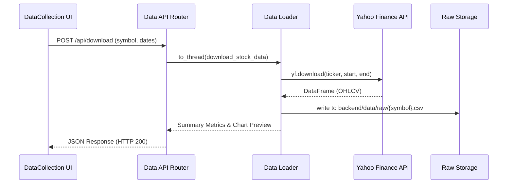

# QuantML Research Platform: Pipeline Flow & Execution Walkthrough

This document provides a highly detailed walkthrough of the execution flow and data transitions across all seven stages of the platform.

````carousel
### Stage 1: Data Collection & Ingestion
#### 1. User Interaction & Trigger
*   **Action**: User inputs asset symbol (e.g., `RELIANCE`, `BTC-USD`) and start/end dates on the **Data Collection** page, then clicks **Download Data**.
*   **UI File**: `frontend/src/pages/DataCollection.jsx` ([DataCollection.jsx](file:///d:/AmazonSchoolOfML/frontend/src/pages/DataCollection.jsx#L43-L83))

#### 2. Network & API Execution
*   **Endpoint**: `POST /api/v1/download` (proxied from Vite port 5173 to FastAPI port 5000)
*   **Controller**: `backend/app/api/data.py` ([data.py](file:///d:/AmazonSchoolOfML/backend/app/api/data.py#L9-L26))
*   **Execution**: Offloaded asynchronously via `asyncio.to_thread` to prevent thread blocks.

#### 3. Core Logic (`backend/app/core/data/data_loader.py`)
*   **Ticker Normalization**: If the ticker is Indian, converts `RELIANCE` to `RELIANCE.NS`. Global tickers (currencies, indices, crypto) are kept as-is.
*   **YFinance API Call**: Downloads daily OHLCV dataframe using `yf.download(...)`.
*   **Data Cleaning**: 
    *   Flattens multi-index columns if present.
    *   Resets index to make `Date` a column and formats it as `YYYY-MM-DD`.
    *   Rounds `Open`, `High`, `Low`, `Close` to 2 decimal places.
*   **Storage**: Saves pandas DataFrame as raw CSV at `backend/data/raw/{symbol}.csv`.
*   **Metrics**: Calculates minimum price, maximum price, average price, starting price, ending price, total return (%), and average daily volume.
*   **Response Payload**: Returns success status, row count, date ranges, summaries, top/bottom rows preview, and daily close prices for the chart.


<!-- slide -->
### Stage 2: Feature Engineering & Target Creation
#### 1. User Interaction & Trigger
*   **Action**: User selects a downloaded dataset on the **Feature Engineering** page and clicks **Process Dataset**.
*   **UI File**: `frontend/src/pages/FeatureEngineering.jsx`

#### 2. Network & API Execution
*   **Endpoint**: `POST /api/v1/features/process`
*   **Controller**: `backend/app/api/features.py` ([features.py](file:///d:/AmazonSchoolOfML/backend/app/api/features.py#L11-L83))
*   **Execution**: Invokes `asyncio.to_thread(_process_features_sync, symbol)`.

#### 3. Core Logic (`backend/app/core/features/`)
*   **Load**: Reads `backend/data/raw/{symbol}.csv`.
*   **Feature Generation (`feature_engineering.py`)**: Computes 31 columns:
    *   *Trend*: EMA20, EMA50, EMA200 (computed as percentage deviation: $\frac{\text{Close} - \text{EMA}}{\text{EMA}}$).
    *   *Momentum*: RSI (14-day Wilder's smoothing), MACD & Signal Line (normalized by Close), and ROC (10-day Rate of Change).
    *   *Volatility*: ATR (Average True Range) and Bollinger Band Width, both normalized by Close.
    *   *Volume*: 20-day Volume Moving Average and Volume Ratio ($\frac{\text{Volume}}{\text{Vol\_MA}}$).
    *   *Returns*: 1-Day, 5-Day, and 10-Day price percentage change.
    *   *Lags*: 1-Day and 2-Day shifted variables for RSI, MACD, Volume Ratio, and 1D Returns.
    *   *Regime Precursors*: Macro trend strength ($\frac{\text{EMA50} - \text{EMA200}}{\text{EMA200}}$), rolling volatility, and ADX (Average Directional Index).
*   **Target Creation (`target_generation.py`)**: 
    *   Shifts Close prices backwards by 1 day (`Tomorrow_Close`).
    *   Creates binary target variable: 
        $$\text{Target}_t = \begin{cases} 1 & \text{if Close}_{t+1} > \text{Close}_t \\ 0 & \text{otherwise} \end{cases}$$
*   **Post-processing**: Drops rows with `NaN` values caused by rolling windows (e.g., EMA200 requires 200 initial rows).
*   **Storage**: Saves the feature table as a CSV at `backend/data/processed/{symbol}_features.csv`.
*   **Response Payload**: Returns column list, row count, class balance (UPs vs DOWNs), head/tail previews, and indicator data points (RSI, MACD) for visual inspection.
<!-- slide -->
### Stage 3: Market Regime Detection
#### 1. User Interaction & Trigger
*   **Action**: User chooses clustering method (Gaussian Mixture Model (GMM) or KMeans) and number of regimes (2 to 5) on the **Market Regimes** page, then clicks **Detect Regimes**.
*   **UI File**: `frontend/src/pages/MarketRegimes.jsx`

#### 2. Network & API Execution
*   **Endpoint**: `POST /api/v1/regime/detect`
*   **Controller**: `backend/app/api/regime.py` ([regime.py](file:///d:/AmazonSchoolOfML/backend/app/api/regime.py#L11-L81))
*   **Execution**: Invokes `asyncio.to_thread(_detect_regimes_sync, symbol, n_regimes, method)`.

#### 3. Core Logic (`backend/app/core/regime/regime_detector.py`)
*   **Load**: Reads `backend/data/processed/{symbol}_features.csv`.
*   **Pre-Processing**: Extracts 7 features prefixed with `Regime_`. Standardizes features using `StandardScaler` to zero mean and unit variance.
*   **Clustering**:
    *   *GMM*: Fits GMM with expectation-maximization, yielding cluster labels and membership probabilities.
    *   *KMeans*: Fits cluster centroids, generating binary labels (dummy probabilities are set to 1.0 for the winning cluster).
*   **Consistent Sorting (Crucial System Design step)**:
    *   Unsupervised clustering assigns random IDs (0, 1, 2) to clusters.
    *   Calculates the average 1-Day return for each cluster.
    *   Re-maps cluster labels by ascending order of returns:
        $$\text{Regime 0 (Bear)} \le \text{Regime 1 (Sideways)} \le \text{Regime 2 (Bull)}$$
    *   This guarantees that Regime 0 always denotes the worst-performing macro state, and Regime 2 denotes the strongest bull market.
*   **State Mapping**: Maps these sorted cluster IDs and corresponding probability curves back into the features CSV.
*   **Storage**: 
    *   Saves the updated feature file back to `backend/data/processed/{symbol}_features.csv`.
    *   Pickles the fitted GMM/KMeans models, scaler parameters, and label configurations to `backend/models/{symbol}_regime.pkl`.
*   **Response Payload**: Returns historical dates, close prices, sorted regime labels, probability arrays, and annualized return/volatility metrics per cluster state.
<!-- slide -->
### Stage 4: Machine Learning Model Training
#### 1. User Interaction & Trigger
*   **Action**: User selects model (Logistic Regression, Random Forest, or XGBoost), configures hyperparameters, toggles **Regime-Aware Training**, and clicks **Train Model**.
*   **UI File**: `frontend/src/pages/MLModels.jsx`

#### 2. Network & API Execution
*   **Endpoint**: `POST /api/v1/models/train`
*   **Controller**: `backend/app/api/models.py` ([models.py](file:///d:/AmazonSchoolOfML/backend/app/api/models.py#L22-L253))
*   **Execution**: Invokes `asyncio.to_thread(_train_model_sync, symbol, model_type, regime_aware, params)`.

#### 3. Core Logic (`backend/app/core/models/`)
*   **Data Split**: Performs chronological train-test split (80% train, 20% test). Avoids random split to prevent data leakage in time-series forecasting.
*   **Core Training Routine**:
    *   **Standard Single Model**: Trains a single model using `FEATURE_COLS` to forecast the binary target variable. Calculates metrics on train and 5-fold TimeSeriesSplit cross-validation.
    *   **Regime-Aware Ensemble**: 
        *   Splits the train dataset into sub-datasets according to the `Regime_Cluster` column.
        *   Trains a separate classifier (with independent scaling/hyperparameters) for each regime.
        *   Aggregates metrics by weighting performance by the proportion of trading days spent in each regime.
*   **Storage**: Saves a metadata pickle bundle at `backend/models/{symbol}_{model_suffix}.pkl` containing:
    *   `regime_aware`: Boolean flag.
    *   `model`: The model instance (or dictionary of model instances for regime-aware mode).
    *   `scaler`: The fitted scaler instance (or dictionary of scalers).
    *   `feature_cols`: List of features used.
    *   `metrics` and `feature_importance`: Calculated train/validation results.
*   **Response Payload**: Returns overall metrics (F1-score, Precision, Recall, Accuracy, AUC), sorted feature importance arrays, and a sample of predicted probabilities for verification.
<!-- slide -->
### Stage 5: Trading Signal Generation
#### 1. User Interaction & Trigger
*   **Action**: User selects a trained model, adjusts the buy probability threshold (default 0.55), chooses trading style (**Long-Short** or **Long-Only**), and clicks **Generate Signals**.
*   **UI File**: `frontend/src/pages/SignalGeneration.jsx`

#### 2. Network & API Execution
*   **Endpoint**: `POST /api/v1/signals/generate`
*   **Controller**: `backend/app/api/signals.py` ([signals.py](file:///d:/AmazonSchoolOfML/backend/app/api/signals.py#L10-L93))
*   **Execution**: Invokes `asyncio.to_thread(_generate_signals_sync, symbol, model_filename, threshold, short_style)`.

#### 3. Core Logic (`backend/app/core/signals/signal_generator.py`)
*   **Load**: Reads test split of engineered features (last 20% of dataset to ensure out-of-sample testing) and loads model pickle.
*   **Probability Prediction**:
    *   *Standard Model*: Runs `.predict_proba()` on scaled out-of-sample features.
    *   *Regime-Aware Ensemble*: Iterates through each test row, checks its `Regime_Cluster`, routes the row's features to the corresponding regime-specific sub-model, and extracts the probability.
*   **Signal Rules**:
    *   If $\text{Probability}_t > \text{threshold} \Rightarrow \text{Signal}_t = 1$ (BUY/Long).
    *   If $\text{Probability}_t \le \text{threshold} \Rightarrow \text{Signal}_t = -1$ (SELL/Short in Long-Short style) or $0$ (Flat in Long-Only style).
*   **Position Changes**: Computes `Position_Change` using `Signal.diff().fillna(0)`. Any non-zero value represents a trade execution trigger.
*   **Storage**: Saves the signal log to `backend/data/processed/{symbol}_signals.csv`.
*   **Response Payload**: Returns trade statistics (buy/sell distribution, trade count), columns preview, and data vectors (dates, price, probability, signals) for plotting.
<!-- slide -->
### Stage 6: Backtesting Simulation
#### 1. User Interaction & Trigger
*   **Action**: User sets initial capital, risk-free rate, Stop-Loss percentage, and Take-Profit percentage on the **Backtesting** page, then clicks **Run Backtest**.
*   **UI File**: `frontend/src/pages/Backtesting.jsx`

#### 2. Network & API Execution
*   **Endpoint**: `POST /api/v1/backtest/run`
*   **Controller**: `backend/app/api/backtest.py` ([backtest.py](file:///d:/AmazonSchoolOfML/backend/app/api/backtest.py#L10-L54))
*   **Execution**: Invokes `asyncio.to_thread(_run_backtest_sync, signal_filename, initial_capital, risk_free_rate, stop_loss, take_profit)`.

#### 3. Core Logic (`backend/app/core/backtesting/backtester.py`)
*   **Load**: Loads `backend/data/processed/{symbol}_signals.csv`.
*   **Execution Loop (Preventing Lookahead Bias)**:
    *   Shifts signals by 1 day: $\text{Signal Shifted}_t = \text{Signal}_{t-1}$. Trades are executed at the market close *after* signal generation.
    *   Tracks current position state ($1, -1, 0$), entry price, entry date, and cumulative trade performance.
    *   **Risk Filters**: On active position days, calculates open PnL:
        *   *Stop Loss*: If open loss exceeds `stop_loss_pct`, exits position early, logs the trade return, and locks the portfolio capital at that value until the signal changes.
        *   *Take Profit*: If open profit exceeds `take_profit_pct`, exits early to lock in gains.
        *   *Normal Exit*: If shifted signal changes, exits/reverses position at the day's close price.
*   **Performance Metrics Calculation**:
    *   *Cumulative Return*: Strategy vs Buy-and-Hold stock wealth curves.
    *   *Drawdown*: Computes current wealth divided by historical peak wealth.
    *   *Sharpe Ratio*: Annualized excess returns divided by daily excess return standard deviation:
        $$\text{Sharpe} = \frac{\text{Mean}(\text{Strategy Return} - \text{Daily Risk Free})}{\text{Std}(\text{Strategy Return} - \text{Daily Risk Free})} \times \sqrt{252}$$
    *   *CAGR*: Annualized growth rate of capital over the backtest window.
    *   *Trade Stats*: Evaluates win rate and average return per closed trade.
*   **Response Payload**: Returns metrics dictionary, chronological list of trades, and cumulative wealth vectors for plotting.
<!-- slide -->
### Stage 7: Model Explainability (SHAP)
#### 1. User Interaction & Trigger
*   **Action**: User selects a trained model on the **SHAP Analysis** page and clicks **Explain Model**.
*   **UI File**: `frontend/src/pages/ShapAnalysis.jsx`

#### 2. Network & API Execution
*   **Endpoint**: `POST /api/v1/explain`
*   **Controller**: `backend/app/api/explain.py` ([explain.py](file:///d:/AmazonSchoolOfML/backend/app/api/explain.py#L10-L45))
*   **Execution**: Invokes `asyncio.to_thread(_explain_model_sync, symbol, model_filename)`.

#### 3. Core Logic (`backend/app/core/explainability/shap_explainer.py`)
*   **Load**: Reads features CSV and model pickle files.
*   **Sample Filtering**: Selects the latest 250 rows for SHAP value computation to maintain high response speed.
*   **SHAP Computations**:
    *   **Standard Single Model**:
        *   Extracts model instance and feature scaler.
        *   If the model is Tree-based (XGBoost or Random Forest), invokes `shap.TreeExplainer(model)`.
        *   If the model is Linear (Logistic Regression), invokes `shap.Explainer(model, X_scaled)`.
        *   Calculates SHAP matrix matching the shape of feature matrix $X$.
    *   **Regime-Aware Ensemble**:
        *   Splits the 250 samples by their detected `Regime_Cluster`.
        *   Passes each sub-slice to the corresponding regime sub-model.
        *   Computes SHAP values independently using the respective model/scaler, and maps results back to the global array.
*   **Payload Structuring**:
    *   *Feature Importance*: Calculates mean absolute SHAP value for each feature:
        $$\text{Importance}_j = \frac{1}{N} \sum_{i=1}^N |\text{SHAP}_{i, j}|$$
    *   *Scatter Plot Data*: Builds a coordinate dataset for each sample-feature combination containing:
        *   `feature`: Column name.
        *   `shap_value`: Impact on the prediction.
        *   `feature_value`: Normalized feature value (for dot color coding).
*   **Response Payload**: Returns feature names, calculated importances, and plot coordinate dictionaries.
````
